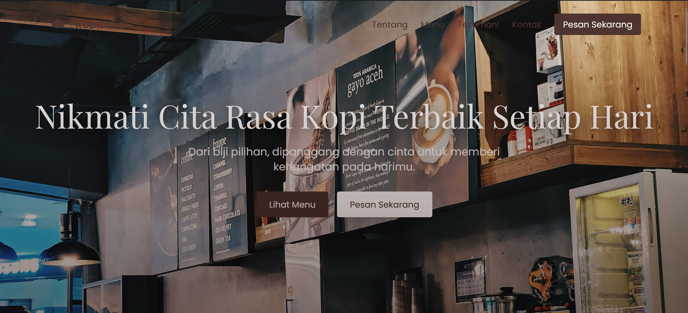
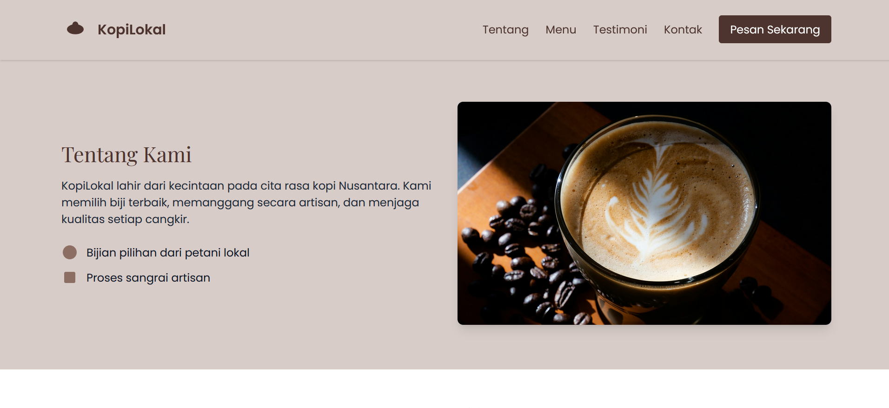

# ☕ KopiLokal — Website Brand Minuman Kopi Premium

Website ini menampilkan brand **KopiLokal**, penyedia minuman kopi premium yang dibuat dari biji kopi pilihan petani lokal.  
Didesain dengan tampilan modern, hangat, dan responsif — cocok untuk memperkenalkan brand kopi kepada pelanggan secara profesional.

🌐 **Live Demo:** [https://kopi-lokal.vercel.app/](https://kopi-lokal.vercel.app/)  

---

## ✨ Fitur Utama

- **Desain Responsif** — tampilan optimal di desktop dan mobile.
- **Hero Section Menarik** — foto kopi premium dengan CTA yang jelas.
- **Tentang Kami** — menampilkan filosofi dan asal kopi lokal.
- **Menu Produk** — showcase 3 varian kopi: *Caffè Latte*, *Espresso*, dan *Americano*.
- **Testimoni Pelanggan** — carousel interaktif dengan animasi halus.
- **Kontak & Lokasi** — tombol WhatsApp & peta Google Maps.
- **Newsletter Form** — pelanggan bisa berlangganan update melalui email.
- **Footer Elegan** — lengkap dengan jam buka & media sosial.

---

## 🛠️ Teknologi yang Digunakan

| Teknologi | Kegunaan |
|------------|-----------|
| **HTML5** | Struktur halaman website |
| **Tailwind CSS** | Styling modern dan responsif |
| **JavaScript (Vanilla)** | Interaksi navbar, carousel, dan efek animasi |
| **AOS (Animate On Scroll)** | Efek animasi saat elemen muncul di scroll |
| **Vercel** | Platform untuk hosting dan deployment otomatis |

---

## 🗂️ Struktur Proyek

```
/project-root
├── index.html
├── /assets
│   ├── /images        → semua gambar produk & hero
│   └── /icons         → logo & ikon media sosial
├── /css
│   └── styles.css     → tambahan styling (opsional)
└── README.md
```

---

## 🚀 Cara Menjalankan Secara Lokal

1. Clone repository:
   ```bash
   git clone https://github.com/Lxtream23/kopi-lokal.git
   ```
2. Masuk ke folder proyek:
   ```bash
   cd kopilokal
   ```
3. Jalankan lewat *Live Server* (VS Code) atau buka langsung di browser:
   ```
   index.html
   ```
4. (Opsional) Untuk pengembangan lebih lanjut, edit file `index.html` dan `styles.css`.

---

## 📸 Preview

  


*Tampilan awal website dengan nuansa hangat khas kopi premium.*
---

## 👨‍💻 Dibuat oleh

**Lukman Hakim**  
Mahasiswa & Web Developer yang mencintai aroma kopi ☕  
📍 *Universitas Yudharta Pasuruan*  
📧 lukmanhakim23072002@gmail.com

---

## 📝 Lisensi

Proyek ini dilisensikan di bawah **MIT License** — bebas digunakan dan dimodifikasi untuk keperluan non-komersial maupun komersial.
